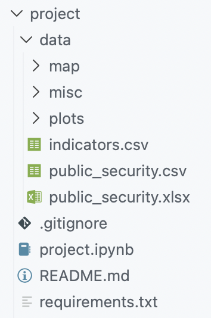

# Programming for data analytics - Project 

This folder includes the final project for the course "Programming for data analytics", Higher Diploma in Science in Data Analytics, ATU Galway Mayo, 2025-2026. 

## Getting started 

The project is included within a broader repository. However, once the repository is downloaded, the folder 'project' can be considered as an independent repository. It includes all the necessary components of a repository, including a README, a .gitignore, and a requirements.txt. 

### Language and dependencies

Language: Python 3.12

Dependencies: The libraries required to run the code are listed in *requirements.txt*. To install all at the same time, run the command: 

    pip install requirements.txt

To install individual packages, use the command: 

    pip install *package name*

Note: if issues arise when running the notebook, re-install geopandas making sure that all its dependencies are also installed. Use the command: 

    pip install 'geopandas[all]'

### Structure 

The code is in the notebook *project.ipynb*, while the folder *data* includes the dataset, the map files, and the plots. 

## About this project 

### The project

The project investigates the topic of perceived insecurity in the United States of Mexico. The dataset was sourced from INEGI, the [National Institute of Statistics and Geography of Mexico](https://en.www.inegi.org.mx/). 

The goal of this project is to show how perceived insecurity has evolved in Mexico over the past 15 years (2011 to 2025). The research aims to answer the following questions:

- How has the perception of public insecurity in Mexico changed over the past 15 years, by sex and by state?  
- How does it look like, now?
- How does it relate with the crime rate? 

### Sections 

The sections of the project are detailled below: 

**1. Data import and data exploration**

Different ways to import the data are explored. Once imported, the data is explored and explained. 

**2. Data clean-up**

The data is cleaned up to avoid issues when performing manipulation, calculations or plotting the data. 

**3. Perceived insecurity among men and women, by state and by municipality**

The first part of the analysis investigates how perceived insecurity has evolved in the past 15 years. Two (four) variables are considered: sex and local dimension (state or municipality).  

**4. Perceived insecurity by state**

This section is the core of the analysis. It explores how perceived insecurity has evolved and looks like now, by state (Mexico is a federation of states). 

- First, the states with highest and lowest rates of perceived insecurity are found. Then, the state with the higest variance is identified. 

- Every state is analysed to find how perceived insecurity has evolved in each state over the past 15 years and classify the trends. 

- A snapshot of perceived insecurity in 2025 is plotted on a map of Mexico 

**5. Correlation between perceived insecurity and crime rates, 2011-2025**

This final sections investigates correlations between perceived insecurity and crime rates (violent and non-violent) in Mexico in 2011-2025. 

**6. Conclusion** 

Findings of the analysis. 

**7. Appendix** 

Extra features include a map of Mexico and an example of line fitting to identify past trends in perceived insecurity. 

## References 

pandas: 
columns https://pandas.pydata.org/docs/reference/api/pandas.DataFrame.columns.html 
dupes https://pandas.pydata.org/docs/reference/api/pandas.DataFrame.drop_duplicates.html
save to csv https://pandas.pydata.org/docs/reference/api/pandas.DataFrame.to_csv.html 
unique values https://pandas.pydata.org/docs/reference/api/pandas.Series.unique.html 

Plots: 
https://matplotlib.org/stable/gallery/color/color_by_yvalue.html 
https://matplotlib.org/stable/api/_as_gen/matplotlib.pyplot.xticks.html
https://matplotlib.org/stable/gallery/color/named_colors.html
x ticks: https://matplotlib.org/stable/gallery/axes_grid1/simple_axisline4.html
subplots: https://www.geeksforgeeks.org/python/how-to-create-subplots-in-seaborn/
ticks https://matplotlib.org/stable/gallery/ticks/ticklabels_rotation.html 
seaborn ticks https://seaborn.pydata.org/generated/seaborn.FacetGrid.set_xticklabels.html 
seaborn line plot https://seaborn.pydata.org/generated/seaborn.lineplot.html 
suptitle # https://matplotlib.org/stable/api/_as_gen/matplotlib.pyplot.suptitle.html
linestyle: https://matplotlib.org/stable/api/_as_gen/matplotlib.axes.Axes.plot.html 

Maps: 
geopandas: https://geopandas.org/en/stable/getting_started/install.html
map: https://github.com/jschleuss/mexican-states/tree/master?tab=License-1-ov-file
map: https://data.humdata.org/dataset/cod-ab-mex 
code example: https://nbviewer.org/github/pysal/inequality/blob/main/docs/user-guide/viz/pengram.ipynb
getting started with geopandas: https://www.youtube.com/watch?v=aGPQXD-rLgw
